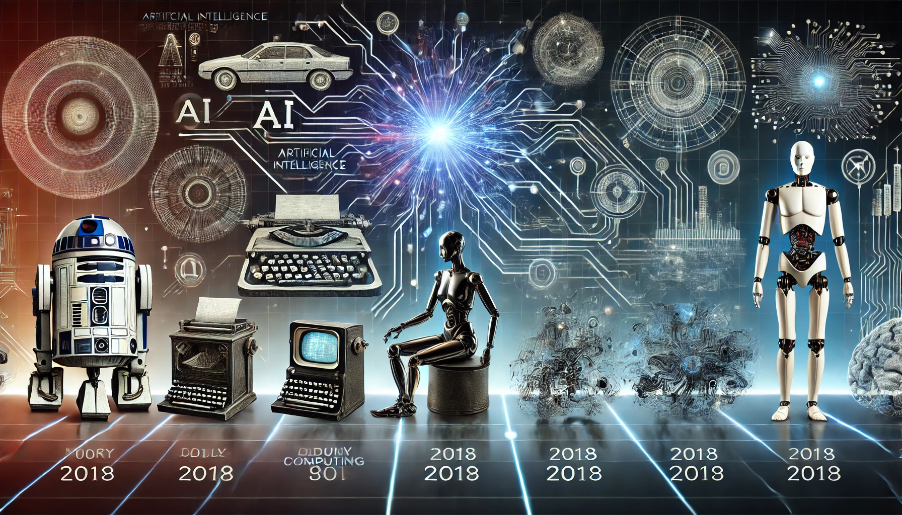

# Unveiling the World of AI and Machine Learning: A Creative Dive

In the ever-evolving realm of technology, **Artificial Intelligence (AI)** and **Machine Learning (ML)** stand as pillars of innovation. These terms, often used interchangeably, harbor profound differences and applications that fuel modern advancements. Join us as we explore their essence, significance, and potential.

---

## **What Are AI and ML?**

At its core, **AI is the simulation of human intelligence by machines**. It enables systems to perform tasks such as reasoning, learning, and adapting. Meanwhile, **ML is a subset of AI**, where algorithms learn from data to improve over time without explicit programming.

### **Key Distinctions:**
- **AI** mimics human behavior.
- **ML** focuses on data-driven learning, building predictive models, and refining results over time.

---

## **The Evolution and Journey of AI**

The journey of AI dates back decades, but its modern explosion began with **the release of foundational models like GPT-3** and the introduction of LLMs (Large Language Models). AI's capabilities grew exponentially as **machine learning evolved**, especially with techniques like deep learning.

**Fun Fact:** AI training involves layers of interconnected neurons, akin to the human brain's functionality.

---

## **Applications of AI and ML in Real Life**

AI and ML aren't confined to laboratories; they touch every aspect of our lives. Here are just a few examples:

- **Healthcare:** Predictive diagnostics, personalized treatments.
- **Finance:** Fraud detection, algorithmic trading.
- **Education:** Personalized learning tools, intelligent tutoring systems.
- **Entertainment:** Content recommendations, game development.

---

## **Diving into LLMs and Their Power**

**Large Language Models** (LLMs) like OpenAI’s GPT and Meta’s Llama represent groundbreaking advancements in AI. These models:
- Utilize extensive datasets to generate coherent and context-aware text.
- Perform tasks ranging from creative writing to answering complex questions.

### **Did You Know?**
LLMs rely on **Natural Language Processing (NLP)** to interpret and generate human-like text.

---

## **AI Tools and Frameworks to Explore**

For those eager to delve into AI development, here are some prominent tools and frameworks:
- **PyTorch:** Ideal for deep learning.
- **TensorFlow:** Popular for machine learning tasks.
- **Hugging Face:** Great for working with pre-trained models.
- **OpenAI API:** For accessing cutting-edge AI functionalities.

---

## **Challenges and Ethics in AI**

As AI proliferates, challenges arise:
- **Bias in Data:** Training models on biased data can lead to skewed results.
- **Privacy Concerns:** Handling sensitive information requires robust security.
- **Ethical Dilemmas:** Balancing innovation with societal impacts.

**Important Note:** Always be cautious with cloud-based AI tools when dealing with confidential data.

---

## **The Future of AI**

The future of AI is boundless, with potential breakthroughs in **autonomous systems, human-like assistants**, and **sustainable solutions**. Yet, it demands responsible development, ensuring AI remains a tool for empowerment rather than harm.

**Quote to Ponder:** _"The key to AI’s future lies in our ability to wield it responsibly."_ – Anonymous

---

## **Getting Started with AI**

### **Steps for Beginners:**
1. **Learn Python:** The go-to language for AI and ML.
2. **Explore Datasets:** Start with datasets like MNIST or Fashion MNIST.
3. **Experiment with Pre-Trained Models:** Try Hugging Face or OpenAI APIs.
4. **Build Projects:** Create simple classifiers or chatbots to hone your skills.

---

Embrace the revolution. AI and ML are no longer just buzzwords—they are the fabric of our digital age. Whether you're a tech enthusiast or a curious learner, the journey into AI is one worth taking.

---