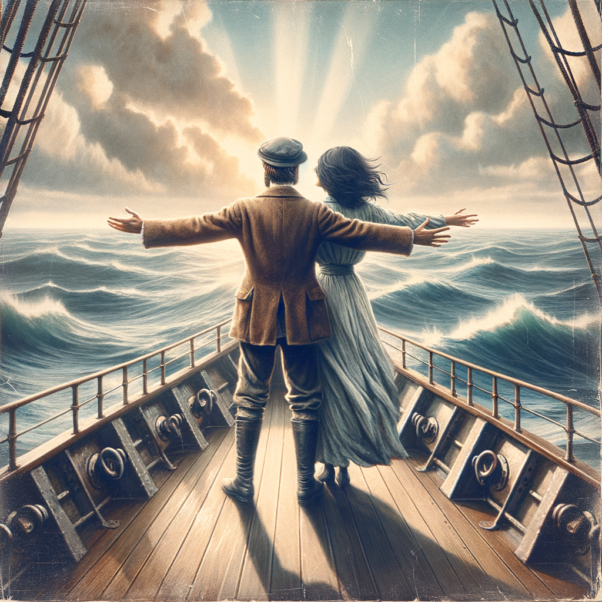
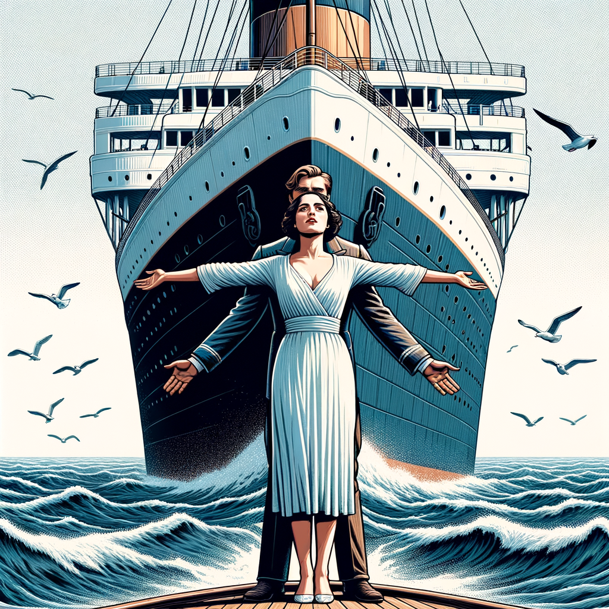
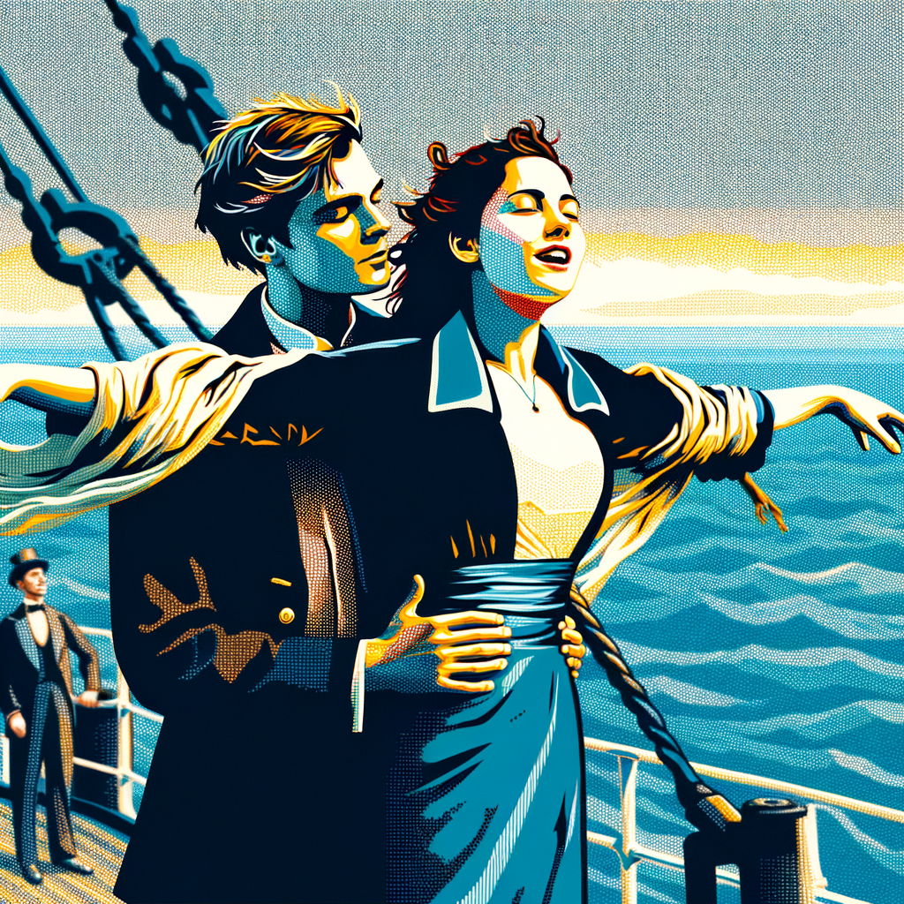
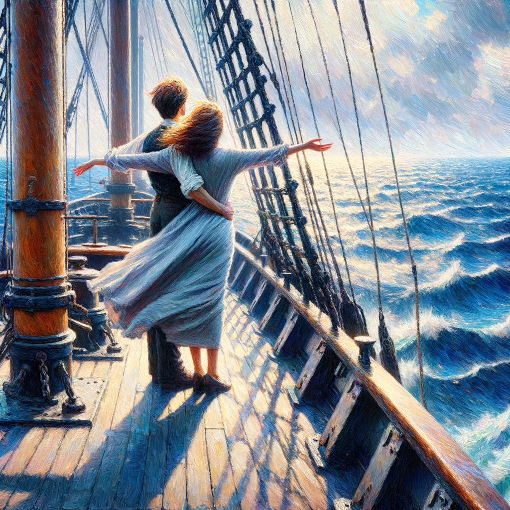
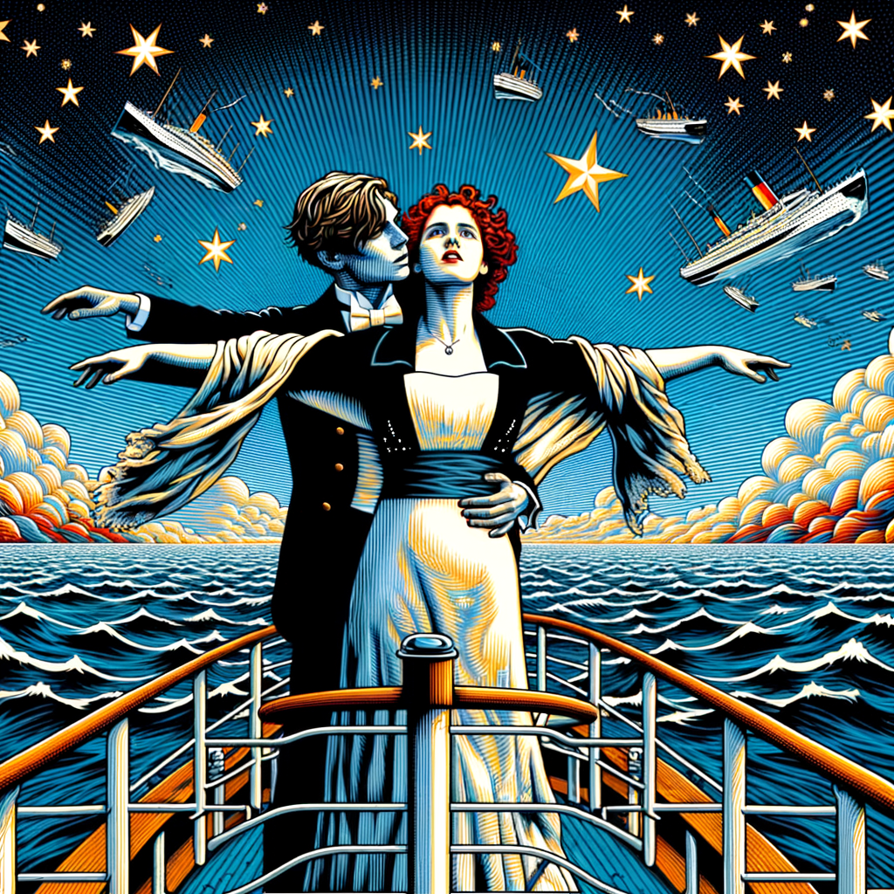
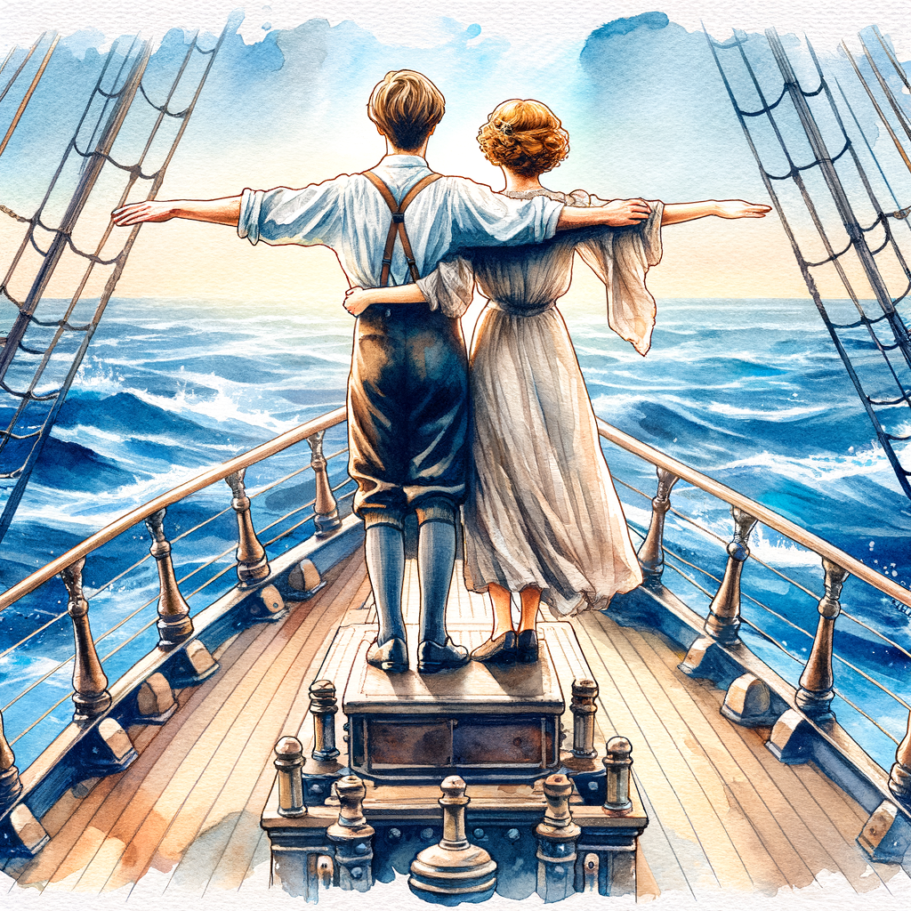
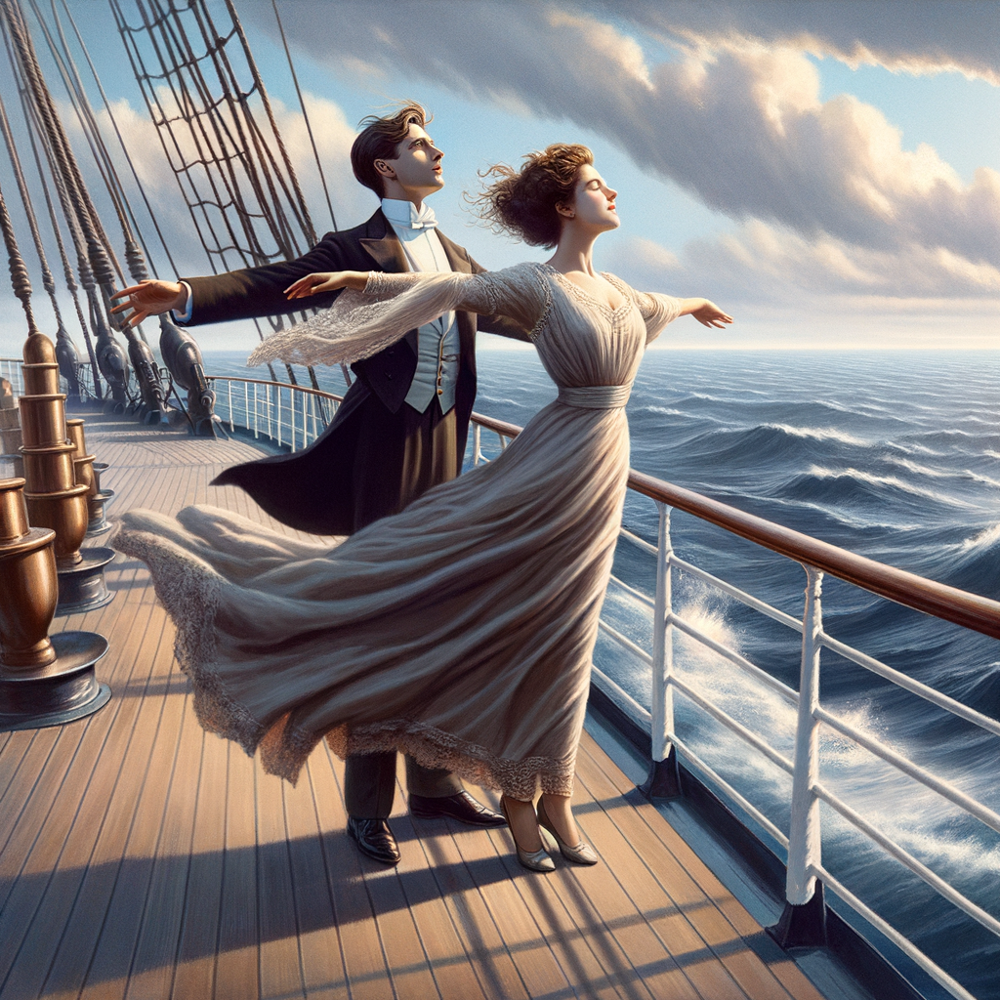
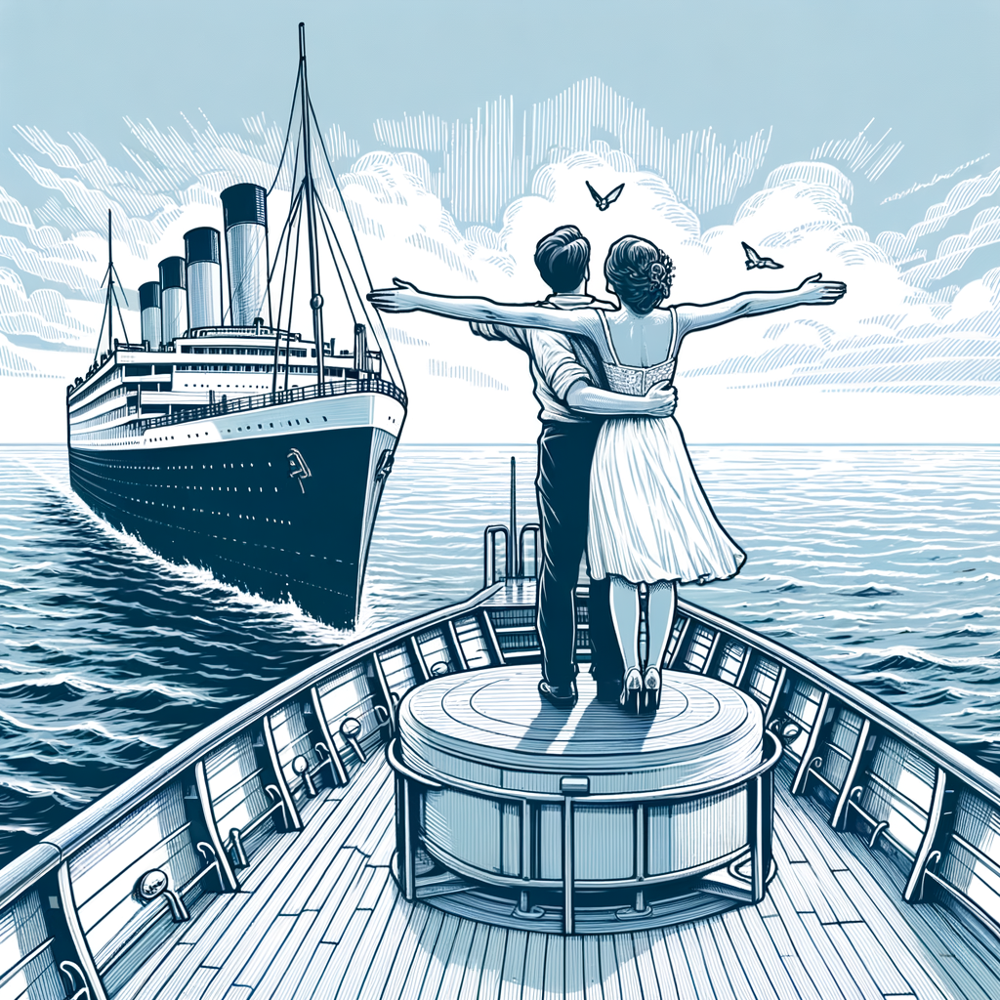
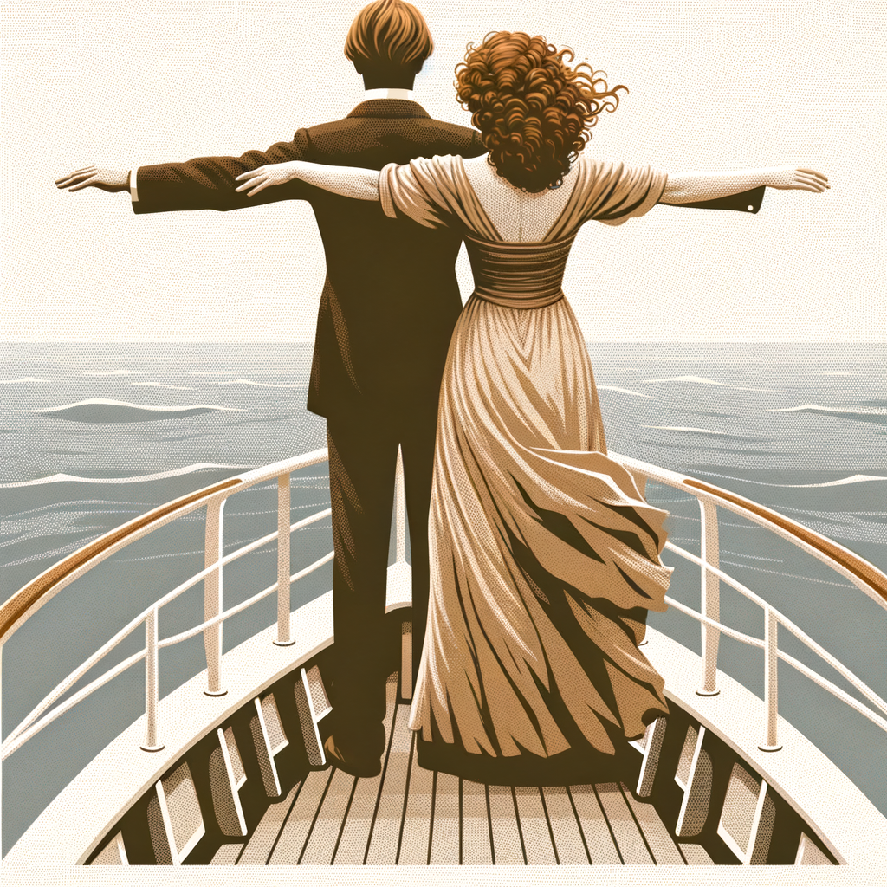
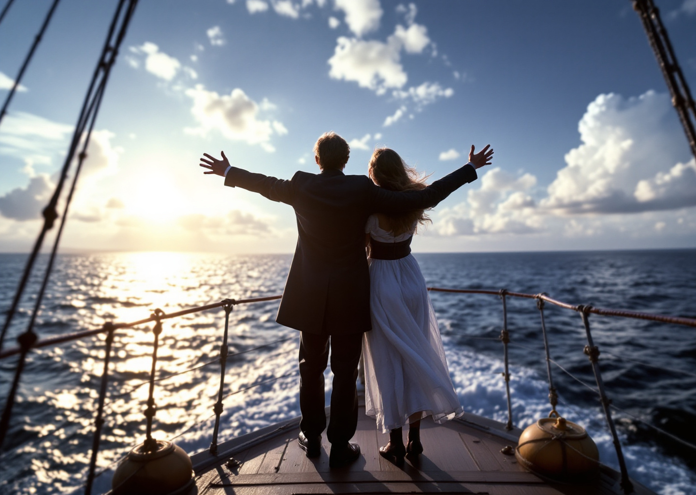

# masters-ai

## Installation

```bash
pip install requirements.txt
```

# Result examples

## Dalle-3
Prompt: Generate an image of the iconic scene from the Titanic movie where Jack and Rose are standing at the bow of the ship, arms outstretched, embracing the feeling of freedom and love as they face the open ocean together in a vintage style.


Prompt: Generate an image of the iconic scene from the Titanic movie where Jack and Rose are standing at the bow of the ship, arms outstretched, embracing the feeling of freedom and love as they face the open ocean together in a modern style.


Prompt: Generate an image of the iconic scene from the Titanic movie where Jack and Rose are standing at the bow of the ship, arms outstretched, embracing the feeling of freedom and love as they face the open ocean together in a abstract style.


Prompt: Generate an image of the iconic scene from the Titanic movie where Jack and Rose are standing at the bow of the ship, arms outstretched, embracing the feeling of freedom and love as they face the open ocean together in a impressionist style.


Prompt: Generate an image of the iconic scene from the Titanic movie where Jack and Rose are standing at the bow of the ship, arms outstretched, embracing the feeling of freedom and love as they face the open ocean together in a pop art style.


Prompt: Generate an image of the iconic scene from the Titanic movie where Jack and Rose are standing at the bow of the ship, arms outstretched, embracing the feeling of freedom and love as they face the open ocean together in a watercolor style.


Prompt: Generate an image of the iconic scene from the Titanic movie where Jack and Rose are standing at the bow of the ship, arms outstretched, embracing the feeling of freedom and love as they face the open ocean together in a digital painting style.


Prompt: Generate an image of the iconic scene from the Titanic movie where Jack and Rose are standing at the bow of the ship, arms outstretched, embracing the feeling of freedom and love as they face the open ocean together in a line art style.


Prompt: Generate an image of the iconic scene from the Titanic movie where Jack and Rose are standing at the bow of the ship, arms outstretched, embracing the feeling of freedom and love as they face the open ocean together in a minimalist style.


## Flux-3
Prompt: Generate an image of the iconic scene from the Titanic movie where Jack and Rose are standing at the bow of the ship, arms outstretched, embracing the feeling of freedom and love as they face the open ocean together.
