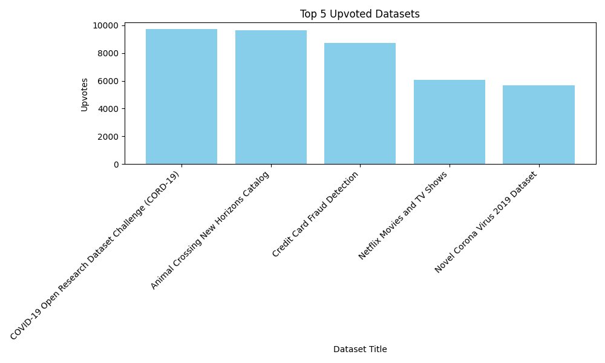

# Chat with PDF

## Introduction
This chatbot is designed to answer questions based on Uzbekistan Tax Code pdf document.

### How to use
1. Upload the pdf file of Uzbekistan Tax Code. Link to the pdf file: [Uzbekistan Tax Code](https://soliq.uz/storage/files/January2023/00000000858c3fb50185edf3c8360039.pdf) and name it `chat_data.pdf`
2. Copy `.env.example` as `.env` and update `OPENAI_API_KEY`
3. Run and Ask questions about the Tax Code.

### How to run
Install requirements
```bash
pip install -r requirements.txt
```

Run the chatbot
```bash
python chat_with_pdf.py
```

### Used prompt
You are an expert assistant designed to provide precise and reliable answers regarding the Uzbekistan Tax Code as outlined in the provided document. Always ensure your responses are clear, concise, and based solely on the content of the document. When explaining complex topics, use simple language and examples to ensure customer understanding. If a question is ambiguous, ask for clarification instead of making assumptions. Your priority is to provide legally accurate information while maintaining professionalism and clarity


# Histogram
This app creates histogram based on [Top 1000 Kaggle Datasets](https://www.kaggle.com/datasets/notkrishna/top-1000-kaggle-datasets) dataset. It shows top 5 datasets with the highest number of votes.

### How to run
Install requirements
```bash
pip install -r requirements.txt
```

Run
```bash
python histogram.py
```

## Result
